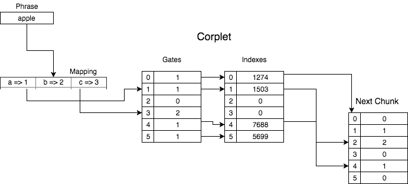

# Corplet

`Corplet` is a binary-corpus storage system that is designed to store extremely large sets of words in a space-optimized format. Corplet is particularly useful for speech and word tagging, and can be used for more complex categories than parts of speech.

## Usage

`Corplet` is a scala package built with the sbt build system. Running the command `$ sbt run` in your shell or running the `main` object will start an interactive Repl where you can play around with Corplets.

```
----- Corplet Repl -----
------************------
|--By: Josh Weinstein--|
corp> open foo
:[Opened Corplet foo]
corp> insert foo rats
:[Inserted rats into Corp: foo]
corp> contains foo rats
:[foo = rats -> true]
corp> contains foo rats hello
:[foo = rats -> true]
:[foo = hello -> true]
corp> close foo
:[Closed Corplet foo]
corp> quit
:[Quit Corplet]

```

You can also use Corplet in scala or java projects.

## Documentation

[Click here to see the detailed documentation](https://jweinst1.github.io/corplet/target/scala-2.12/api/corplet/index.html)

## Implementation

`Corplet` uses a binary-digit-trie data structure that are stored in `.corp` files. These tries are traversed through Java's nio file channels and `MappedByteBuffers`, which allow for asynchronus file input/output, and to only load minimal data into memory when traversing the corpus.

### File Format

A `.corp` file consists of a three byte header, followed by an unlimited number of 243 byte `BodyChunks` that act as nodes in the binary trie.

**Header:**

```
[33][39][83]
```

**BodyChunk:**

```
-Gates-(Bytes)
[0][0][0][0][0]............[0] #27 Gates, 27 bytes

-Indexes-(64 bit Longs)
[0][0][0][0][0]............[0] #27 Indexes, 216 Bytes
```

Each index is a 64 bit number, identical to a Java Long, that acts as a pointer to some byte address later in the file. This is so the Corplet can be continuously grown by appending more chunks to the file without moving anything.

However, this also means a Corplet does not allow deletion of any words. You will need to create a new Corplet if you want to remove words.

#### `Phrases`:

A phrase is some string that contains any lower case letter or a space character. The characters in these strings

#### `Gate`:

Each gate can have the value 0, 1 or 2. This corresponds to whether or not a character mapped digit exists as a child node, or a phrase has ended.

* 0 -> There is no child chunk, and there is no phrase ending here.
* 1 -> There is a child chunk at the corresponding index slot, and a phrase has not ended here.
* 2 -> There could be a child chunk, or not, but a phrase ends here. This means the contans method will return true when finding a phrase that it's last character is mapped here.

### Example

Here is a diagram to demonstrate how this works.


